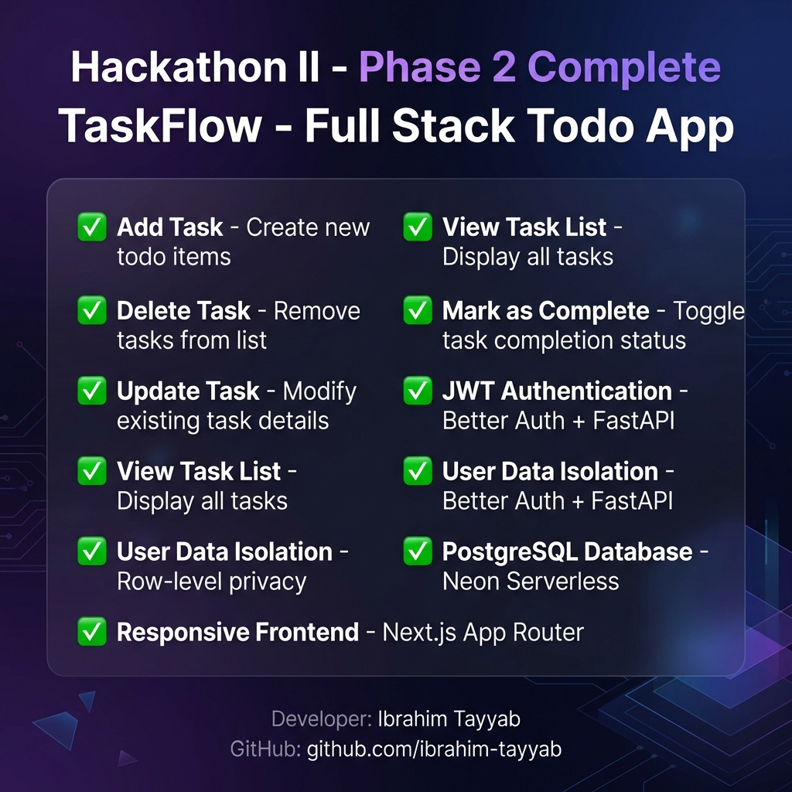

# TaskFlow - Full-Stack Todo Application



<div align="center">

**Hackathon II • Phase 2 Complete • Spec-Driven Development**

[](https://nextjs.org/)
[](https://fastapi.tiangolo.com/)
[](https://neon.tech/)
[](LICENSE)

</div>

---

## ✅ Phase 2 Requirements - All Complete

### Basic Level (Core Essentials)
| Feature | Status | Description |
|---------|--------|-------------|
| Add Task | ✅ | Create new todo items |
| Delete Task | ✅ | Remove tasks from the list |
| Update Task | ✅ | Modify existing task details |
| View Task List | ✅ | Display all tasks |
| Mark as Complete | ✅ | Toggle task completion status |

### Phase 2 Requirements
| Feature | Status | Description |
|---------|--------|-------------|
| JWT Authentication | ✅ | Better Auth + FastAPI token-based auth |
| User Data Isolation | ✅ | Row-level privacy via user_id |
| PostgreSQL Database | ✅ | Neon Serverless PostgreSQL |
| RESTful API | ✅ | FastAPI + SQLModel |
| Responsive Frontend | ✅ | Next.js 14 App Router |

---

## 🚀 Quick Start

### Prerequisites
- Node.js 18+
- Python 3.9+
- PostgreSQL (Neon account)

### 1. Clone & Install

```bash
git clone https://github.com/ibrahim-tayyab/taskflow-fullstack.git
cd taskflow-fullstack

# Frontend
cd web-app
npm install

# Backend
cd ../backend_workaround
pip install -r requirements.txt
```

### 2. Environment Setup

**Frontend** (`web-app/.env.local`):
```env
NEXT_PUBLIC_API_URL=http://localhost:8000
```

**Backend** (`.env`):
```env
DATABASE_URL=your_neon_connection_string
BETTER_AUTH_SECRET=your_secret_key
```

### 3. Run

```bash
# Terminal 1: Backend (port 8000)
cd backend_workaround
python -m uvicorn main:app --reload --port 8000

# Terminal 2: Frontend (port 3000)
cd web-app
npm run dev
```

🎉 **Open http://localhost:3000**

---

## 📡 API Endpoints

### Authentication
| Method | Endpoint | Description |
|--------|----------|-------------|
| POST | `/api/auth/signup` | Create account + get JWT |
| POST | `/api/auth/login` | Login + get JWT |

### Tasks (JWT Required)
| Method | Endpoint | Description |
|--------|----------|-------------|
| GET | `/api/tasks/` | Get user's tasks |
| POST | `/api/tasks/` | Create task |
| PUT | `/api/tasks/{id}` | Update task |
| DELETE | `/api/tasks/{id}` | Delete task |
| PATCH | `/api/tasks/{id}/complete` | Toggle completion |

---

## 🏗️ Project Structure

```
taskflow-fullstack/
├── web-app/                 # Next.js Frontend
│   ├── src/
│   │   ├── app/            # Pages
│   │   ├── components/     # UI components
│   │   └── services/       # API services
│   └── public/             # Static assets
│
├── backend_workaround/      # FastAPI Backend
│   ├── api/v1/endpoints/   # API routes
│   ├── core/               # Security
│   ├── models/             # Database models
│   └── main.py
│
├── banner.png              # Project banner
└── vercel.json             # Deployment config
```

---

## 🔒 Security Features

- **Password Hashing**: PBKDF2-SHA256
- **JWT Tokens**: 7-day expiry
- **Data Isolation**: All queries filter by user_id
- **No Session DB Lookups**: Pure JWT verification

---

## 👨‍💻 Developer

**Ibrahim Tayyab**

[](https://github.com/ibrahim-tayyab)

---

<div align="center">

Made with ❤️ for **Hackathon II - Panaversity**

</div>